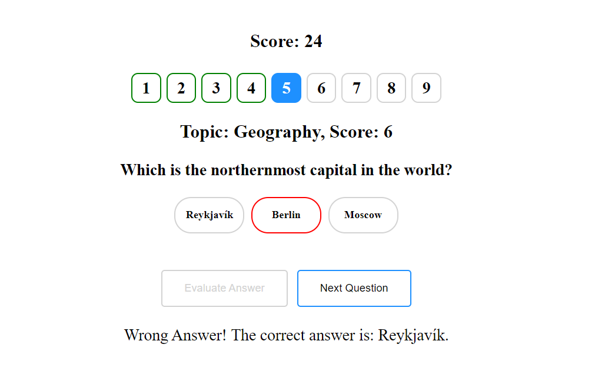
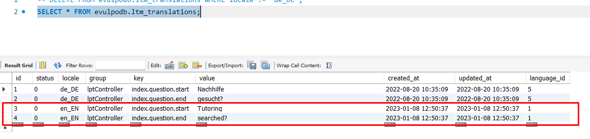

# Solution for evulpo assessment

I have create two folders `task1` and `task2`, and each of them contains the solution of each task respectively.

## Task 1

In order to run it you need to execute `npx http-server -c-1` into the task1 folder.

Then you can visit the basic webpage into your browser under the following address `http://127.0.0.1:8080`. Port `8080` may be differ.

Below is some screenshots from the carousel:

---

User need to select an option and click the `Evaluate Answer` button.


---

Evaluation marks the selected option with green or red color depending if the user made the correct selection and allows to the user to proceed to the next question with the `Next Question` button. The score update accordingly.


---

User has proceed to the 5th question and has answer wrong the question.



---

End of the quiz game.


---


## Task 2

Stack: Node.js, SQL, DeepL API, MySQL
I created a Node.js script that translates the data from the table from one language to another storing the output on the same table.

Assumptions: I supposed that the source language exists into the database
and the target do not.

My Solution:

I created an Node.JS scripts in order to achieve the translation goal, from ane language to another appending the translated rows into the same table. 
1. The script reads as command line arguments the needed parameters, like
	a) Source Locale, b) Target Locale that is specific the the ltm_translations table and the 
	c) target language id. Also need two additional arguments that is related to the DeepL API
	the d) api source language and e) the api target language. I provide these 2 lasts parameters because for example for the English language you need to specify if you need US or GB.
2. It connects to the Database and retrieves all the rows that matches the source locale parameter.
3. Extracts the text that need to be translated and
4. Prepare the payload for the DeepL API request
5. It sends the requests and when is gets the response from the API
6. It constructs the new rows for the target locale and then
7. It inserts the rows into the database ltm_translations table

I created also a UI/UX flow diagram using Figma that represents the above steps:


In order to run it, you need to install the dependency packages first (for DeepL API and MySQL) with the following command: `npm install` execute the following command into `task2` folder.

You need to have installed the `Node.js` and `npm` before you execute the above command. The versions that i have developed the script are:

```sh
node -v
# v16.15.0

npm -v
# 8.9.0
```

I created a `DeepL` account and i have chosen the Developer Plan in order to take a free API key with monthly limit of 500.000 character for translation. And thats why i demonstrate my execution with a small subset of rows and not all.

Into `task2/config.js` are the credentials for the DeepL API Key and the database connectivity. You can use the same DeepL API key, but you need to provide your own database credentials.


I initialize the database. After the initialization the database contains the following rows:


Then i run the script in order to translate a table (ltm_translations provided SQL example ) from one language to another and storing the output on the same table.


```sh
node index.js <DATABASE_SOURCE_LOCALE> <DATABASE_TARGET_LOCALE> <TARGET_LANGUAGE_ID> <API_SOURCE_LANGUAGE> <API_TARGET_LANGUAGE>

# An example to translate DE to EN.
# For DeepL you need to specify en-US or en-GB
node index.js de_DE en_EN 1 de en-US
```

And the below picture depicts the result of the translation:


