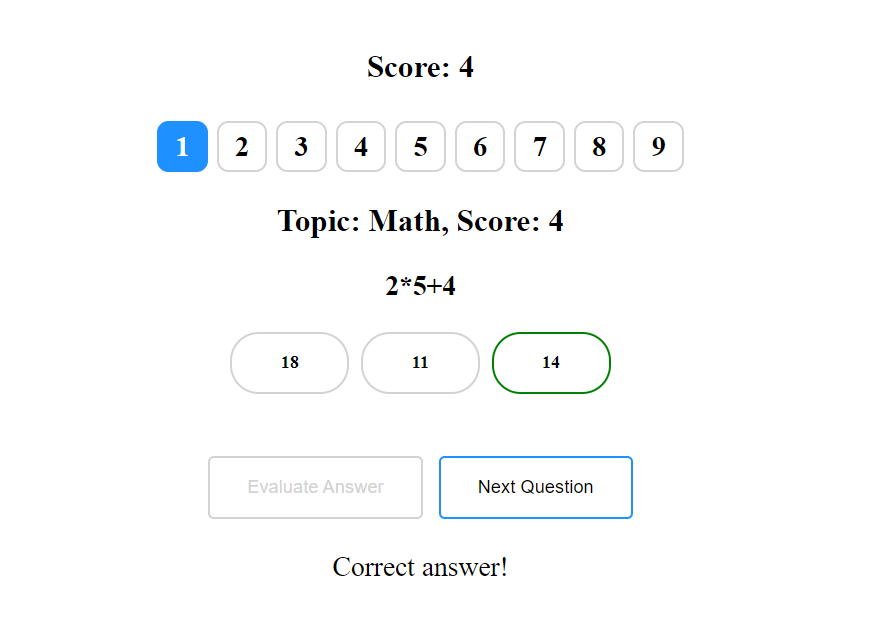

# Solutions for evulpo assessment

I have create two folders `task1` and `task2`, and its of them contains the solution of each Task.

## Task 1

In order to run it you need to execute `npx http-server -c-1` into the task1 folder.

Then you can visit the basic webpage into your browser under the following address `http://127.0.0.1:8080`. Port `8080` may be differ.

Below is some screenshots from the carousel:

User need to select an option and click the `Evaluate Answer` button.

---

Evaluation marks the selected option with green or red color depending if the user made the correct selection and allows to the user to proceed to the next question with the `Next Question` button. The score update accordingly.

---

---
